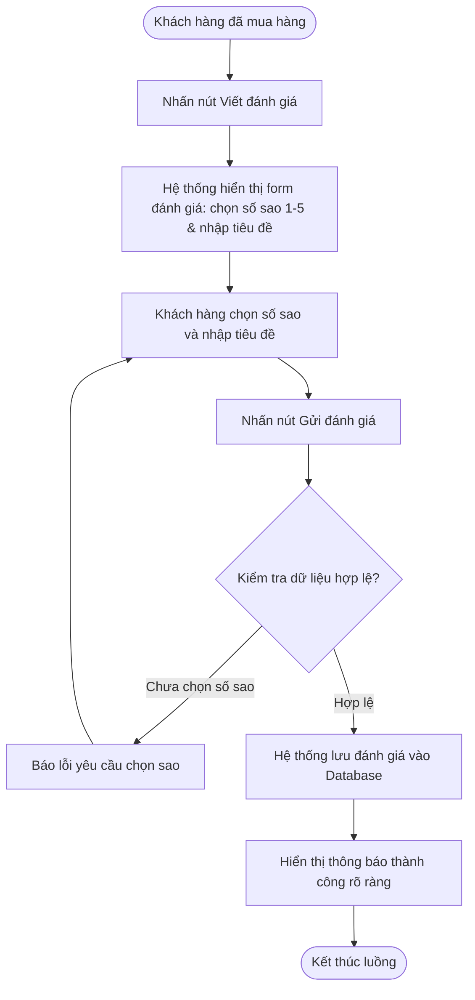
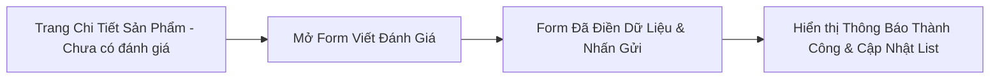

# BÁO CÁO BÀI TẬP: THỰC HÀNH THIẾT KẾ TÍNH NĂNG ĐÁNH GIÁ SẢN PHẨM RIKKEISHOP

> 👤 **Học viên:** Đỗ Hoàng Sơn | **Mã SV:** PTIT-HCM-066
> 🏫 **Môn học:** IT105-K25-Phan-tich-thi-t-k-h-th-ng

---

## 📊 Sơ đồ thiết kế hệ thống (Activity Diagram)

> 💡 *Sơ đồ dưới đây được render tự động trực tiếp trên GitHub bằng Mermaid. Bạn cũng có thể tải file **`bt1.drawio`** trong repository này để mở và chỉnh sửa trực tiếp trên [Draw.io (diagrams.net)](https://app.diagrams.net).* 

---

## 🎨 Thiết kế Giao diện UI/UX trên Figma (Wireframe & Prototype)

> 🔗 **Figma Design Canvas:** [Mở Artboard Thiết kế trên Figma](https://www.figma.com/design/loisleyExBs3b9E13lLcSD/thuc-hanh-thiet-ke-tinh-nang-anh-gi?node-id=0%3A1&m=dev)  
> 🚀 **Figma Interactive Prototype:** [Trải nghiệm Bản mẫu Tương tác Prototype](https://www.figma.com/proto/loisleyExBs3b9E13lLcSD/thuc-hanh-thiet-ke-tinh-nang-anh-gi?page-id=0%3A1&node-id=1%3A2&viewport=256%2C48%2C0.5&scaling=scale-down&starting-point-node-id=1%3A2)  
> 📋 Chi tiết thông số Design System và wireframe đầy đủ xem tại file: [**`bt1_FIGMA.md`**](bt1_FIGMA.md)

### 📱 Sơ đồ luồng tương tác màn hình (UI Navigation Flow)

### 🎯 Bảng màu & Quy chuẩn thiết kế giao diện

| Thành phần Token | Giá trị HEX / Quy cách | Mục đích sử dụng |
| :--- | :---: | :--- |
| Primary Brand | `#2563EB` | Màu chủ đạo, nút bấm chính (CTA), active state |
| Secondary Accent | `#3B82F6` | Màu bổ trợ, link tương tác, thanh trạng thái |
| Background Surface | `#F8FAFC` / `#FFFFFF` | Nền tổng thể và bề mặt các card giao diện |
| Typography | Inter / Roboto (24px, 18px, 14px, 12px) | Font chữ tiêu chuẩn, rõ nét đa độ phân giải |
| 8-Point Grid | Spacing 8px, 16px, 24px, 32px | Đảm bảo tỷ lệ cân đối và bố cục hài hòa |

---

## Nhiệm vụ 1: Phân tích Use Case và Xác định yếu tố UI

Dựa vào kịch bản Use Case mà đội BA đã bàn giao, tác nhân (Actor) chính tương tác với hệ thống là 'Khách hàng đã mua sản phẩm'. Mục tiêu của họ là chia sẻ trải nghiệm thực tế để giúp những khách hàng mới bớt lưỡng lự khi mua sắm tại RikkeiShop.

Tiến hành phân tích chi tiết các hành động nhập liệu trong kịch bản để ánh xạ chính xác sang các thành phần UI tương ứng như bảng bên dưới:

- Actor: Khách hàng đã mua sản phẩm.
- Hành động 1: Chọn số sao từ 1 đến 5 sao.
- Hành động 2: Nhập tiêu đề ngắn cho đánh giá.

| Hành động nhập liệu trong Use Case | Thành phần UI tương ứng | Mô tả chi tiết kỹ thuật |
| --- | --- | --- |
| Chọn số sao (1-5) | Star Rating Component (Interactive Star Icons) | Gồm 5 icon ngôi sao nằm ngang. Khi rê chuột hoặc chạm vào sao nào, các sao từ 1 đến vị trí đó sẽ đổi sang màu vàng active. Lưu giá trị số nguyên từ 1 đến 5. |
| Nhập tiêu đề ngắn | Text Input Field (Single-line Textbox) | Ô nhập văn bản một dòng, có placeholder gợi ý như 'Nhập tiêu đề đánh giá của bạn (ví dụ: Sản phẩm dùng rất tốt)...', kèm giới hạn ký tự tối đa. |

## Nhiệm vụ 2: Thiết kế Wireframe theo luồng

Sau khi đã xác định rõ các thành phần UI ở bước trước, tiến hành xây dựng 2 khung Wireframe liên tiếp gắn trực tiếp vào khu vực trống của trang Chi tiết sản phẩm RikkeiShop để tạo thành một luồng hoàn chỉnh:

Khung 1 (Form Viết Đánh Giá Đang Mở): Bổ sung thêm nút 'Viết đánh giá' nổi bật ở khu vực tổng quan đánh giá sản phẩm. Khi khách hàng click vào nút này, hệ thống bật khung form gồm dải 5 ngôi sao tương tác và ô nhập tiêu đề ngắn, đi kèm nút 'Gửi đánh giá'.

Khung 2 (Màn Hình Sau Khi Gửi Đánh Giá): Ngay sau khi khách hàng điền xong và nhấn nút 'Gửi đánh giá', hệ thống chuyển trạng thái hiển thị thông báo xác nhận thành công rõ ràng (ví dụ: thanh thông báo màu xanh lá xuất hiện phía trên cùng dòng chữ 'Gửi đánh giá thành công! Cảm ơn bạn đã đóng góp ý kiến').

- Luồng tương tác được thiết kế tối giản, tập trung cao độ vào tỷ lệ chuyển đổi và trải nghiệm mượt mà trên cả thiết bị di động lẫn máy tính.
- Bố cục các nút bấm tuân thủ nguyên tắc khoảng cách an toàn (touch target >= 48px trên mobile).

## Nhiệm vụ 3: Tinh chỉnh theo nguyên tắc UI và Đánh giá UX

Đối chiếu Khung 2 với nguyên tắc Feedback trong thiết kế trải nghiệm người dùng: Nếu hệ thống chỉ đóng form lại một cách im lặng mà không hiển thị bất kỳ thông báo xác nhận nào cho người dùng, tính năng này chắc chắn sẽ rơi vào bẫy 'Good UI nhưng Bad UX'.

Giải thích chi tiết: Giao diện form có thể được thiết kế rất đẹp mắt, căn chỉnh chuẩn grid, màu sắc hài hòa (Good UI). Tuy nhiên, vì thiếu đi phản hồi trực quan (Feedback) sau khi submit, người dùng sẽ rơi vào trạng thái hoang mang không biết đánh giá của mình đã được hệ thống ghi nhận hay chưa, dẫn đến việc họ cứ bấm gửi liên tục hoặc cảm thấy bực bội vì mất niềm tin vào hệ thống (Bad UX).

- Quy tắc vàng: Mọi hành động quan trọng của người dùng (đặc biệt là hành động ghi dữ liệu như Gửi đánh giá) bắt buộc phải có thông hồi đáp (Feedback) rõ ràng trong vòng dưới 1 giây.
- Giải pháp áp dụng: Luôn luôn kết hợp thông báo dạng Toast Message hoặc Modal thành công kết hợp cập nhật ngay đánh giá mới lên đầu danh sách.

---

## 📁 Danh sách tệp tin nộp bài trong Repository
- 📝 `bt1.docx`: Báo cáo tài liệu phân tích nghiệp vụ hoàn chỉnh.
- 🎨 `bt1.drawio`: File thiết kế sơ đồ chuẩn theo quy định đề bài (mở trực tiếp bằng [Draw.io](https://app.diagrams.net) hoặc Lucidchart).
- 🎨 [Figma Design Canvas](https://www.figma.com/design/loisleyExBs3b9E13lLcSD/thuc-hanh-thiet-ke-tinh-nang-anh-gi?node-id=0%3A1&m=dev): Không gian làm việc Artboard thiết kế UI/UX trên Figma.
- 🚀 [Figma Live Prototype](https://www.figma.com/proto/loisleyExBs3b9E13lLcSD/thuc-hanh-thiet-ke-tinh-nang-anh-gi?page-id=0%3A1&node-id=1%3A2&viewport=256%2C48%2C0.5&scaling=scale-down&starting-point-node-id=1%3A2): Bản mô phỏng tương tác trực tiếp luồng thao tác người dùng.
- 📋 `bt1_FIGMA.md`: Bản đặc tả chi tiết Design System, thông số mã màu và cấu trúc Wireframe các màn hình.
