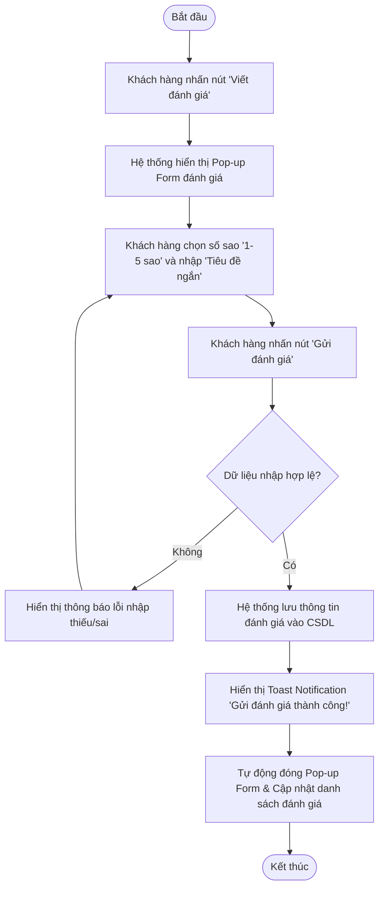

# BÁO CÁO THIẾT KẾ TÍNH NĂNG ĐÁNH GIÁ SẢN PHẨM RIKKEISHOP - SESSION 14

> 👤 **Học viên:** Đỗ Hoàng Sơn | **Mã SV:** PTIT-HCM-066
> 🏫 **Môn học:** IT105-K25-Phan-tich-thi-t-k-h-th-ng

---

## 📊 Sơ đồ thiết kế hệ thống (Activity Diagram)

> 💡 *Sơ đồ dưới đây được render tự động trực tiếp trên GitHub bằng Mermaid. Bạn cũng có thể tải file **`bt1.drawio`** trong repository này để mở và chỉnh sửa trực tiếp trên [Draw.io (diagrams.net)](https://app.diagrams.net).* 

---

## Nhiệm vụ 1: Phân tích Use Case & Xác định yếu tố UI

Dựa trên kịch bản Use Case do BA bàn giao: 'Khách hàng đã mua sản phẩm nhấn nút Viết đánh giá -> Hệ thống hiện form gồm: chọn số sao (1-5), ô nhập tiêu đề ngắn -> Khách hàng điền xong, nhấn Gửi đánh giá -> Hệ thống báo thành công', em tiến hành phân tích tác nhân và ánh xạ hành động nhập liệu sang các thành phần giao diện tương ứng.

- Tác nhân (Actor): Khách hàng đã mua sản phẩm thành công.
- Mục tiêu: Đóng góp ý kiến, đánh giá chất lượng sản phẩm để hỗ trợ người mua sau có thêm thông tin tham khảo.

| STT | Hành động nghiệp vụ (Use Case Action) | Thành phần UI tương ứng (UI Element) | Ghi chú thiết kế UI |
| --- | --- | --- | --- |
| 1 | Khách hàng chọn số sao từ 1 đến 5 | Rating Bar / Star Rating Selector (5 icon hình ngôi sao) | Cho phép click/hover để chọn nhanh số sao từ 1 đến 5 sao. |
| 2 | Khách hàng nhập tiêu đề ngắn | Text Input Field / Single-line Text Box (Ô nhập văn bản 1 dòng) | Có placeholder hướng dẫn như 'Nhập tiêu đề đánh giá (ví dụ: Sản phẩm rất tốt)...' |
| 3 | Khách hàng xác nhận gửi | Primary Button ('Gửi đánh giá') | Nút bấm nổi bật (màu sắc chủ đạo) đặt ở cuối Form. |

## Nhiệm vụ 2: Vẽ Wireframe theo luồng giao diện

Dưới đây là mô tả cấu trúc thiết kế 2 khung Wireframe nối tiếp nhau theo đúng luồng tương tác trên trang Chi tiết sản phẩm RikkeiShop:

- Khung 1 - Màn hình Chi tiết sản phẩm với Form 'Viết đánh giá' đang mở: Nút 'Viết đánh giá' đặt nổi bật tại khu vực Tổng quan đánh giá. Khi click, một Pop-up Modal hiển thị ở giữa màn hình gồm: Tiêu đề 'Đánh giá sản phẩm', Thành phần chọn sao (Star Rating Selector 1-5 sao), Ô nhập liệu 'Tiêu đề ngắn' kèm placeholder, Nút Hủy và Nút 'Gửi đánh giá' (Primary Button).
- Khung 2 - Màn hình sau khi nhấn 'Gửi đánh giá': Pop-up Form đóng lại. Ngay lập tức ở góc trên bên phải màn hình xuất hiện một thông báo Toast (Toast Notification) màu xanh lá với biểu tượng dấu tick: 'Gửi đánh giá thành công! Cảm ơn bạn đã đóng góp ý kiến.' Đồng thời, khu vực danh sách đánh giá bên dưới tự động cập nhật hiển thị đánh giá mới.

## Nhiệm vụ 3: Tinh chỉnh theo nguyên tắc UI/UX (Nguyên tắc Feedback)

Đánh giá phân loại: Đây là trường hợp Good UI nhưng Bad UX.

Giải thích chi tiết (1-2 câu): Dù giao diện form có thể được thiết kế rất đẹp mắt và hiện đại (Good UI), nhưng việc đóng form mà không có bất kỳ thông báo xác nhận nào sẽ khiến người dùng hoang mang, không biết đánh giá của mình đã được lưu thành công hay chưa (Bad UX). Sự thiếu hụt phản hồi (Visibility of System Status) này dễ dẫn đến việc người dùng nhấn nút gửi liên tục gây trùng lặp dữ liệu hoặc cảm thấy khó chịu và rời bỏ website.

---

## 📁 Danh sách tệp tin nộp bài trong Repository
- 📝 `bt1.docx`: Báo cáo tài liệu phân tích nghiệp vụ hoàn chỉnh.
- 🎨 `bt1.drawio`: File thiết kế sơ đồ chuẩn theo quy định đề bài (mở trực tiếp bằng [Draw.io](https://app.diagrams.net) hoặc Lucidchart).
