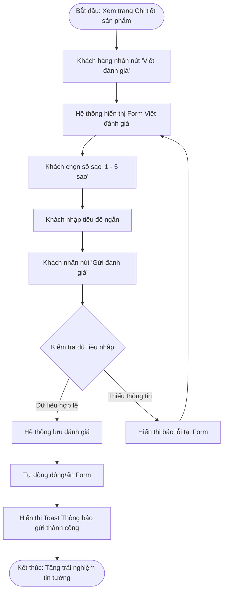

# BÀI LÀM BÀI TẬP 1 - SESSION 14: THỰC HÀNH THIẾT KẾ TÍNH NĂNG ĐÁNH GIÁ SẢN PHẨM RIKKEISHOP

> 👤 **Học viên:** Đỗ Hoàng Sơn | **Mã SV:** PTIT-HCM-066
> 🏫 **Môn học:** IT105-K25-Phan-tich-thi-t-k-h-th-ng

---

## 📊 Sơ đồ thiết kế hệ thống (Flowchart)

> 💡 *Sơ đồ dưới đây được render tự động trực tiếp trên GitHub bằng Mermaid. Bạn cũng có thể tải file **`bt1.drawio`** trong repository này để mở và chỉnh sửa trực tiếp trên [Draw.io (diagrams.net)](https://app.diagrams.net).* 

---

## Nhiệm vụ 1: Phân tích Use Case & Xác định yếu tố UI

Căn cứ theo kịch bản Use Case được cung cấp từ Business Analyst (BA), tác nhân (Actor) thực hiện luồng công việc này là 'Khách hàng đã mua sản phẩm'. Để hiện thực hóa các hành động tương tác của người dùng trên giao diện, các hành động nhập liệu được ánh xạ tương ứng với các thành phần giao diện (UI Elements) tiêu chuẩn như sau:

| STT | Hành động người dùng (Use Case Action) | Thành phần UI tương ứng (UI Element) | Mô tả chi tiết thành phần UI |
| --- | --- | --- | --- |
| 1 | Chọn số sao (từ 1 đến 5) | Star Rating Component | Bộ chọn đánh giá hình 5 ngôi sao tương tác, hỗ trợ hiệu ứng hover và click để chọn mức điểm từ 1 đến 5 sao. |
| 2 | Nhập tiêu đề ngắn | Single-line Text Input | Ô nhập liệu văn bản 1 dòng có placeholder 'Nhập tiêu đề đánh giá của bạn...', giới hạn tối đa 100 ký tự. |
| 3 | Nhấn 'Gửi đánh giá' | Primary Action Button | Nút bấm hành động chính có nhãn 'Gửi đánh giá', nổi bật trực quan để kích hoạt gửi dữ liệu lên hệ thống. |

## Nhiệm vụ 2: Thiết kế Wireframe theo luồng

Dựa trên bố cục khung nền trang Chi tiết sản phẩm RikkeiShop hiện trạng, luồng giao diện tính năng 'Viết đánh giá' được thiết kế nối tiếp qua 2 khung Wireframe chuyển tiếp như sau:

- Khung Wireframe 1 (Form 'Viết đánh giá' đang mở): Đặt ngay dưới khu vực thông tin chung của sản phẩm và phía trên danh sách nhận xét cũ. Form hiển thị gồm tiêu đề 'Đánh giá sản phẩm này', bộ chọn 5 ngôi sao (Star Rating), ô Text Input nhập tiêu đề ngắn, cùng nút bấm 'Gửi đánh giá' màu xanh thương hiệu.
- Khung Wireframe 2 (Màn hình sau khi gửi đánh giá thành công): Sau khi người dùng nhấn nút 'Gửi đánh giá', Form nhập liệu tự động thu ẩn lại. Ngay tại vị trí đó hiển thị một thông báo xác nhận thành công (Success Toast Alert) với nền xanh lá nhẹ, biểu tượng checkmark lá cây lá và dòng chữ: 'Cảm ơn bạn! Đánh giá của bạn đã được gửi thành công và đang được hệ thống phê duyệt.'

## Nhiệm vụ 3: Tinh chỉnh theo nguyên tắc UI (Đánh giá Good UI / Bad UX)

Nội dung phân tích đối chiếu với nguyên tắc Phản hồi hệ thống (System Feedback):

- Nếu hệ thống chỉ tự động đóng form sau khi nhấn nút 'Gửi đánh giá' mà không xuất hiện bất kỳ thông báo xác nhận nào, tính năng này bị rơi vào trường hợp BAD UX (Mặc dù có thể đạt Good UI về mặt gọn gàng giao diện).
- Lý do: Việc thiếu tín hiệu phản hồi ngay lập tức (System Feedback) vi phạm nguyên tắc cốt lõi của UX Design. Người dùng sẽ rơi vào trạng thái hoang mang, không biết hành động gửi đánh giá đã thực sự thành công hay bị lỗi mạng, dẫn đến tâm lý phân vân, có nguy cơ bấm gửi lại nhiều lần tạo ra dữ liệu trùng lặp hoặc rời đi với trải nghiệm không hài lòng.

---

## 📁 Danh sách tệp tin nộp bài trong Repository
- 📝 `bt1.docx`: Báo cáo tài liệu phân tích nghiệp vụ hoàn chỉnh.
- 🎨 `bt1.drawio`: File thiết kế sơ đồ chuẩn theo quy định đề bài (mở trực tiếp bằng [Draw.io](https://app.diagrams.net) hoặc Lucidchart).
