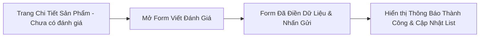

# 🎨 BẢN ĐẶC TẢ THIẾT KẾ GIAO DIỆN UI/UX TRÊN FIGMA

> 👤 **Học viên:** Đỗ Hoàng Sơn | **Mã SV:** PTIT-HCM-066
> 🏫 **Môn học:** IT105-K25-Phan-tich-thi-t-k-h-th-ng
> 📌 **Bài tập:** Bài 1 - Session 14
> 🏷️ **Dự án thiết kế:** RikkeiShop Product Review Feature UI UX Design

---

## 🔗 LIÊN KẾT TRỰC TIẾP DỰ ÁN FIGMA

[](https://www.figma.com/design/loisleyExBs3b9E13lLcSD/thuc-hanh-thiet-ke-tinh-nang-anh-gi?node-id=0%3A1&m=dev)
[](https://www.figma.com/proto/loisleyExBs3b9E13lLcSD/thuc-hanh-thiet-ke-tinh-nang-anh-gi?page-id=0%3A1&node-id=1%3A2&viewport=256%2C48%2C0.5&scaling=scale-down&starting-point-node-id=1%3A2)

- 🎨 **Figma Design Canvas (Artboards, Styles & Design Tokens):**  
  👉 [https://www.figma.com/design/loisleyExBs3b9E13lLcSD/thuc-hanh-thiet-ke-tinh-nang-anh-gi?node-id=0%3A1&m=dev](https://www.figma.com/design/loisleyExBs3b9E13lLcSD/thuc-hanh-thiet-ke-tinh-nang-anh-gi?node-id=0%3A1&m=dev)
- 🚀 **Figma Interactive Prototype (Trải nghiệm tương tác luồng người dùng):**  
  👉 [https://www.figma.com/proto/loisleyExBs3b9E13lLcSD/thuc-hanh-thiet-ke-tinh-nang-anh-gi?page-id=0%3A1&node-id=1%3A2&viewport=256%2C48%2C0.5&scaling=scale-down&starting-point-node-id=1%3A2](https://www.figma.com/proto/loisleyExBs3b9E13lLcSD/thuc-hanh-thiet-ke-tinh-nang-anh-gi?page-id=0%3A1&node-id=1%3A2&viewport=256%2C48%2C0.5&scaling=scale-down&starting-point-node-id=1%3A2)

---

## 🎯 1. HỆ THỐNG THIẾT KẾ (DESIGN SYSTEM & TOKENS)

### 🎨 Bảng mã màu chuẩn (Color Palette)

| Tên Token | Mã HEX | Vai trò & Ứng dụng |
| :--- | :---: | :--- |
| Primary Brand | `#FF6600` | Nút Gửi đánh giá, icon sao active |
| Secondary Accent | `#00B14F` | Thông báo thành công, badge đã mua hàng |
| Background Canvas | `#F5F5F5` | Nền tổng thể trang chi tiết sản phẩm |
| Surface Card | `#FFFFFF` | Nền form đánh giá, khung sản phẩm |
| Text Primary | `#222222` | Tiêu đề, nội dung chính |

### ✍️ Quy chuẩn Typography & Font chữ

- **Font Family:** `Inter`, `Roboto`, `system-ui` (Độ rõ nét cao trên mọi màn hình).
- **H1 (Header chính màn hình):** 24px - Bold (700) - Line height 32px.
- **H2 (Tiêu đề phân đoạn / Block header):** 18px - SemiBold (600) - Line height 24px.
- **Body Text (Nội dung văn bản):** 14px - Regular (400) - Line height 20px.
- **Caption & Footnote:** 12px - Medium (500) - Line height 16px.

### 📐 Hệ thống Lưới & Khoảng cách (Grid & Spacing)

- **Quy tắc 8-Point Grid:** Toàn bộ khoảng cách lề (margin), khoảng cách đệm (padding) tuân thủ bội số của 8 (8px, 16px, 24px, 32px, 48px).
- **Bố cục Layout Grid:** Mobile 4 cột (Margin 16px, Gutter 16px) hoặc Web Responsive 12 cột (Max-width 1200px, Gutter 24px).

---

## 📱 2. SƠ ĐỒ LUỒNG ĐIỀU HƯỚNG GIAO DIỆN (UI FLOW)



---

## 📐 3. ĐẶC TẢ CHI TIẾT CÁC MÀN HÌNH WIREFRAME

### 📱 Màn hình 1: Form Viết Đánh Giá Đang Mở

> 💡 **Mục đích:** Cho phép khách hàng tương tác nhập liệu số sao và tiêu đề ngắn

**Các thành phần UI chính:**
- 🔹 Tiêu đề form Đánh giá sản phẩm
- 🔹 Thành phần chọn 5 ngôi sao tương tác
- 🔹 Ô nhập liệu tiêu đề ngắn
- 🔹 Nút hành động chính Gửi đánh giá

**Bố cục Wireframe & Phân vùng màn hình:**
```text
Header (Trang chi tiết) -> Section Đánh giá -> Form Modal/Inline (Chọn sao + Ô input tiêu đề + Nút Gửi)
```

### 📱 Màn hình 2: Màn Hình Sau Khi Gửi Đánh Giá Thành Công

> 💡 **Mục đích:** Cung cấp phản hồi rõ ràng ngay lập tức cho người dùng biết thao tác đã hoàn tất

**Các thành phần UI chính:**
- 🔹 Thông báo dạng Toast / Banner 'Gửi đánh giá thành công!'
- 🔹 Form được đóng lại hoặc reset
- 🔹 Hiển thị đánh giá mới trong danh sách phía dưới

**Bố cục Wireframe & Phân vùng màn hình:**
```text
Header -> Banner thông báo thành công (Green) -> Danh sách đánh giá cập nhật
```

---

## 🛠️ 4. HƯỚNG DẪN XEM VÀ KIỂM TRA TRÊN FIGMA

1. **Chế độ xem Thiết kế (Design Canvas):** Nhấp vào link [Figma Design Canvas](https://www.figma.com/design/loisleyExBs3b9E13lLcSD/thuc-hanh-thiet-ke-tinh-nang-anh-gi?node-id=0%3A1&m=dev) để xem toàn bộ hệ thống Artboard, phân lớp Layer, Auto-layout và các Components.
2. **Chế độ chạy thử nghiệm (Interactive Prototype):** Nhấp vào link [Figma Live Prototype](https://www.figma.com/proto/loisleyExBs3b9E13lLcSD/thuc-hanh-thiet-ke-tinh-nang-anh-gi?page-id=0%3A1&node-id=1%3A2&viewport=256%2C48%2C0.5&scaling=scale-down&starting-point-node-id=1%3A2) để trực tiếp click thử nghiệm các tương tác chuyển trang, hiệu ứng Smart Animate và luồng thao tác người dùng.
